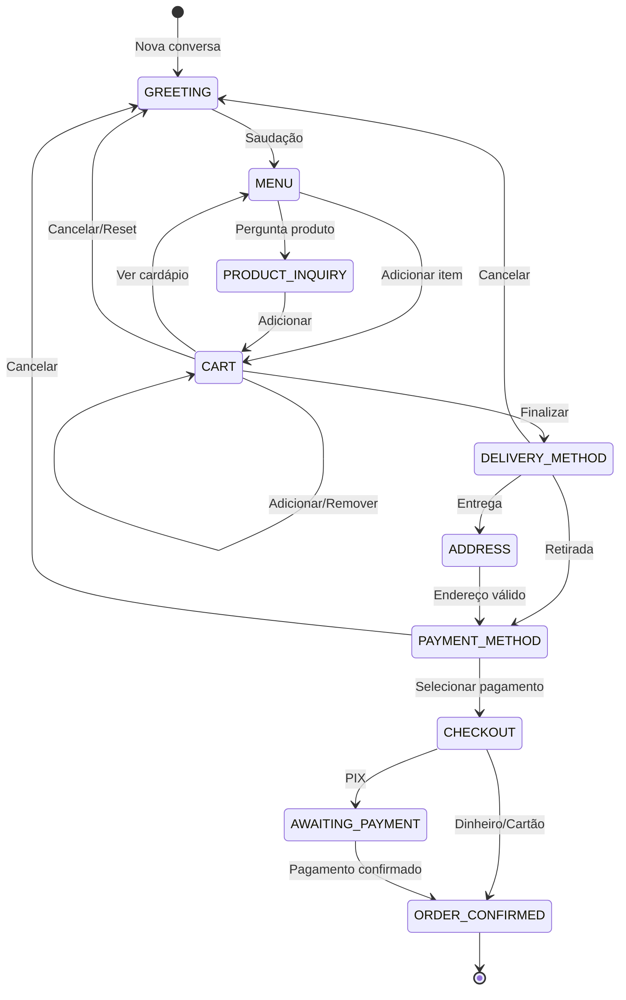

# Sistema de Orquestração LangGraph - Pastita

## Visão Geral

Sistema completo de orquestração de conversas WhatsApp usando LangGraph, integrado com os models e services existentes do Django.

## Arquitetura

```
┌─────────────────────────────────────────────────────────────────┐
│                    LangGraph Orchestrator                        │
├─────────────────────────────────────────────────────────────────┤
│                                                                  │
│  ┌──────────────┐    ┌──────────────┐    ┌──────────────┐      │
│  │ detect_intent │───▶│route_context │───▶│execute_handler│     │
│  └──────────────┘    └──────────────┘    └──────────────┘      │
│         │                   │                   │               │
│         ▼                   ▼                   ▼               │
│  ┌─────────────────────────────────────────────────────────┐  │
│  │              Context Router Decision                     │  │
│  │  ┌─────────┐  ┌─────────────┐  ┌─────────────────────┐  │  │
│  │  │ HANDLER │  │ AUTOMESSAGE │  │ LLM (fallback only) │  │  │
│  │  └────┬────┘  └──────┬──────┘  └──────────┬──────────┘  │  │
│  │       └───────────────┴────────────────────┘            │  │
│  └─────────────────────────────────────────────────────────┘  │
│                              │                                  │
│                              ▼                                  │
│  ┌─────────────────────────────────────────────────────────┐  │
│  │                    System Tools                          │  │
│  │  • get_menu() • add_to_cart() • create_order()          │  │
│  │  • view_cart() • calculate_delivery_fee()               │  │
│  │  • generate_pix() • check_order_status()                │  │
│  └─────────────────────────────────────────────────────────┘  │
│                              │                                  │
│                              ▼                                  │
│  ┌─────────────────────────────────────────────────────────┐  │
│  │              Django Models & Services                    │  │
│  │  • StoreOrder • StoreProduct • CustomerSession          │  │
│  │  • WhatsAppAccount • CompanyProfile • Store             │  │
│  └─────────────────────────────────────────────────────────┘  │
│                                                                  │
└─────────────────────────────────────────────────────────────────┘
```

## Estados do Grafo



## Fluxo de Estados

| Estado | Descrição | Transições Possíveis |
|--------|-----------|---------------------|
| `greeting` | Saudação inicial | menu, human_handoff |
| `menu` | Exibindo cardápio | cart, product_inquiry |
| `product_inquiry` | Consultando produto | cart, menu |
| `cart` | Gerenciando carrinho | menu, delivery_method, checkout |
| `delivery_method` | Selecionando entrega/retirada | address, payment_method |
| `address` | Coletando endereço | payment_method |
| `payment_method` | Selecionando pagamento | checkout |
| `checkout` | Finalizando pedido | awaiting_payment, order_confirmed |
| `awaiting_payment` | Aguardando PIX | order_confirmed |
| `order_confirmed` | Pedido confirmado | greeting |
| `human_handoff` | Transferido para humano | - |
| `error` | Estado de erro | greeting |

## Sistema de Decisão Contextual

O `ContextRouter` decide qual fonte de resposta usar:

### Regras de Prioridade

1. **HANDLER (100% precisão)**
   - Ações de carrinho: add, remove, view, clear
   - Ações de pedido: create, confirm, cancel
   - Pagamento: request_pix, confirm_payment
   - Estados críticos: checkout, awaiting_payment

2. **AUTOMESSAGE**
   - Saudações configuradas
   - Mensagens de status padrão
   - Respostas rápidas predefinidas

3. **LLM (fallback apenas)**
   - Intenções desconhecidas
   - Após 2+ falhas de handler
   - Perguntas complexas fora do fluxo

## Tools do Sistema

### Carrinho
- `get_menu(store_id)` - Retorna cardápio formatado
- `get_product_info(store_id, product_name)` - Detalhes do produto
- `add_to_cart(session_id, product_name, quantity)` - Adiciona item
- `remove_from_cart(session_id, product_index)` - Remove item
- `view_cart(session_id)` - Mostra carrinho
- `clear_cart(session_id)` - Limpa carrinho

### Pedido
- `calculate_delivery_fee(store_id, address)` - Calcula frete via HERE API
- `create_order(session_id, payment_method, delivery_method)` - Cria pedido
- `generate_pix(order_id)` - Gera PIX via Mercado Pago
- `check_order_status(order_number)` - Verifica status

### Mensagens
- `get_automessage_for_status(company_id, status)` - Busca mensagem automática
- `send_whatsapp_message(account_id, to_number, message)` - Envia mensagem

## Notificações Automáticas

O sistema escuta mudanças de status em `StoreOrder` via signals:

| Status | Mensagem Padrão |
|--------|-----------------|
| `confirmed` | "Pedido confirmado!" |
| `preparing` | "Pedido em preparo" |
| `ready` | "Pedido pronto!" |
| `out_for_delivery` | "Saiu para entrega" |
| `delivered` | "Pedido entregue!" |
| `cancelled` | "Pedido cancelado" |

## Tratamento de Erros

### Casos Inusitados

1. **Cliente muda de ideia no checkout**
   - Comando "cancelar" reseta para greeting
   - Carrinho preservado para reutilização

2. **Produto indisponível**
   - Verificação de estoque antes de adicionar
   - Mensagem informativa com alternativas

3. **Endereço fora da área**
   - HERE API calcula distância
   - Sugere retirada na loja

4. **PIX expirado**
   - Gera novo código automaticamente
   - Mantém mesmo pedido

5. **Carrinho vazio ao finalizar**
   - Redireciona para cardápio
   - Mensagem informativa

6. **Múltiplas mensagens seguidas**
   - Sistema processa uma por vez
   - Fila de mensagens no ConversationState

7. **Timeout de sessão**
   - Sessões expiram após inatividade
   - Carrinho preservado por 24h

## Instalação

### 1. Instalar dependências

```bash
pip install langgraph>=0.2.0
```

### 2. Configurar variáveis de ambiente

```bash
# HERE API (para cálculo de frete)
HERE_API_KEY=your_here_api_key

# Mercado Pago (para PIX)
MERCADO_PAGO_ACCESS_TOKEN=your_mp_token
```

### 3. Aplicar migrations (se necessário)

```bash
python manage.py migrate
```

## Uso

### Processar mensagem

```python
from apps.automation.services import process_whatsapp_message_langgraph

result = process_whatsapp_message_langgraph(
    account=whatsapp_account,
    conversation=conversation,
    message_text="Quero 2 rondelli",
    debug=True
)

print(result['response_text'])
```

### Usar orquestrador diretamente

```python
from apps.automation.services import LangGraphOrchestrator

orchestrator = LangGraphOrchestrator(
    account=account,
    conversation=conversation,
    company=company,
    store=store,
    debug=True
)

result = orchestrator.process_message("Oi")
```

### Usar tools individualmente

```python
from apps.automation.services import get_menu, add_to_cart

# Buscar cardápio
menu = get_menu.invoke({'store_id': 'store-uuid'})

# Adicionar ao carrinho
result = add_to_cart.invoke({
    'session_id': 'session-uuid',
    'product_name': 'Rondelli de Frango',
    'quantity': 2
})
```

## Testes

### Rodar testes unitários

```bash
pytest apps/automation/tests/test_pastita_tools.py -v
```

### Rodar testes de integração

```bash
pytest apps/automation/tests/test_langgraph_integration.py -v
```

### Rodar todos os testes

```bash
pytest apps/automation/tests/ -v
```

## Estrutura de Arquivos

```
apps/automation/
├── services/
│   ├── __init__.py
│   ├── pastita_langgraph_orchestrator.py  # Orquestrador principal
│   ├── pastita_tools.py                    # Tools do sistema
│   └── ...
├── graphs/
│   ├── __init__.py
│   └── pastita_graph.py                    # Definição do grafo
├── signals/
│   ├── __init__.py
│   └── order_signals.py                    # Notificações automáticas
├── tests/
│   ├── __init__.py
│   ├── test_pastita_tools.py              # Testes unitários
│   └── test_langgraph_integration.py      # Testes de integração
└── ...
```

## Diagrama Completo do Grafo

```
                    ┌─────────────────┐
                    │   detect_intent  │
                    └────────┬────────┘
                             │
                             ▼
                    ┌─────────────────┐
                    │  route_context   │
                    └────────┬────────┘
                             │
           ┌─────────────────┼─────────────────┐
           │                 │                 │
           ▼                 ▼                 ▼
   ┌──────────────┐ ┌──────────────┐ ┌──────────────┐
   │execute_handler│ │execute_auto  │ │generate_llm  │
   │              │ │  _message     │ │  _response   │
   └──────┬───────┘ └──────┬───────┘ └──────┬───────┘
          │                │                │
          └────────────────┼────────────────┘
                           │
                           ▼
                  ┌─────────────────┐
                  │   update_state   │
                  └────────┬────────┘
                           │
                           ▼
                         [END]
```

## Considerações de Design

1. **Sem Alucinações**: LLM é usado apenas como fallback, nunca para ações críticas
2. **Precisão 100%**: Todas as ações de carrinho/pedido usam handlers determinísticos
3. **Fallback Apropriado**: Erros são tratados com mensagens amigáveis
4. **Compatibilidade**: Usa apenas models e services existentes
5. **Extensibilidade**: Novos estados e tools podem ser adicionados facilmente
