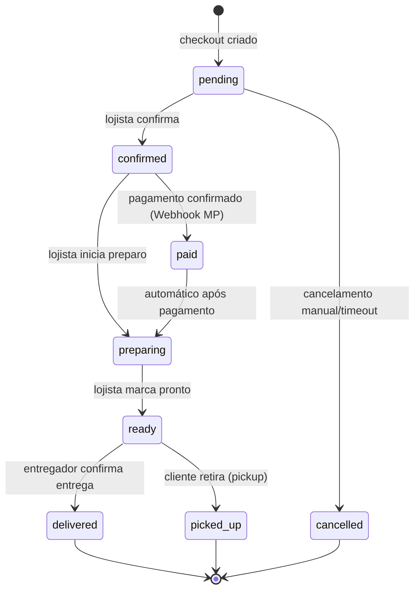
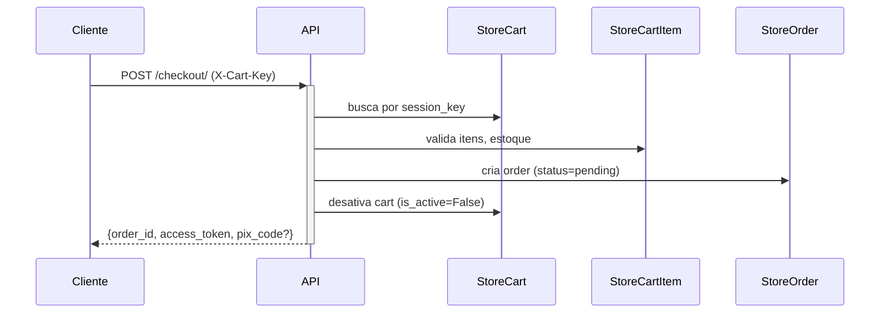
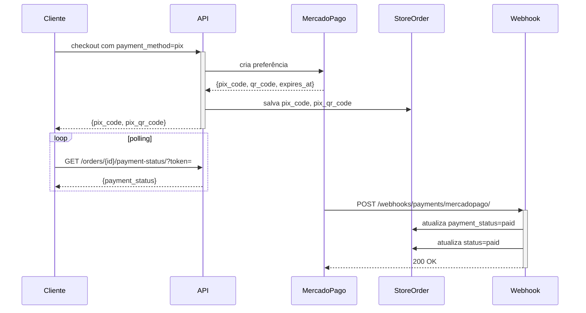
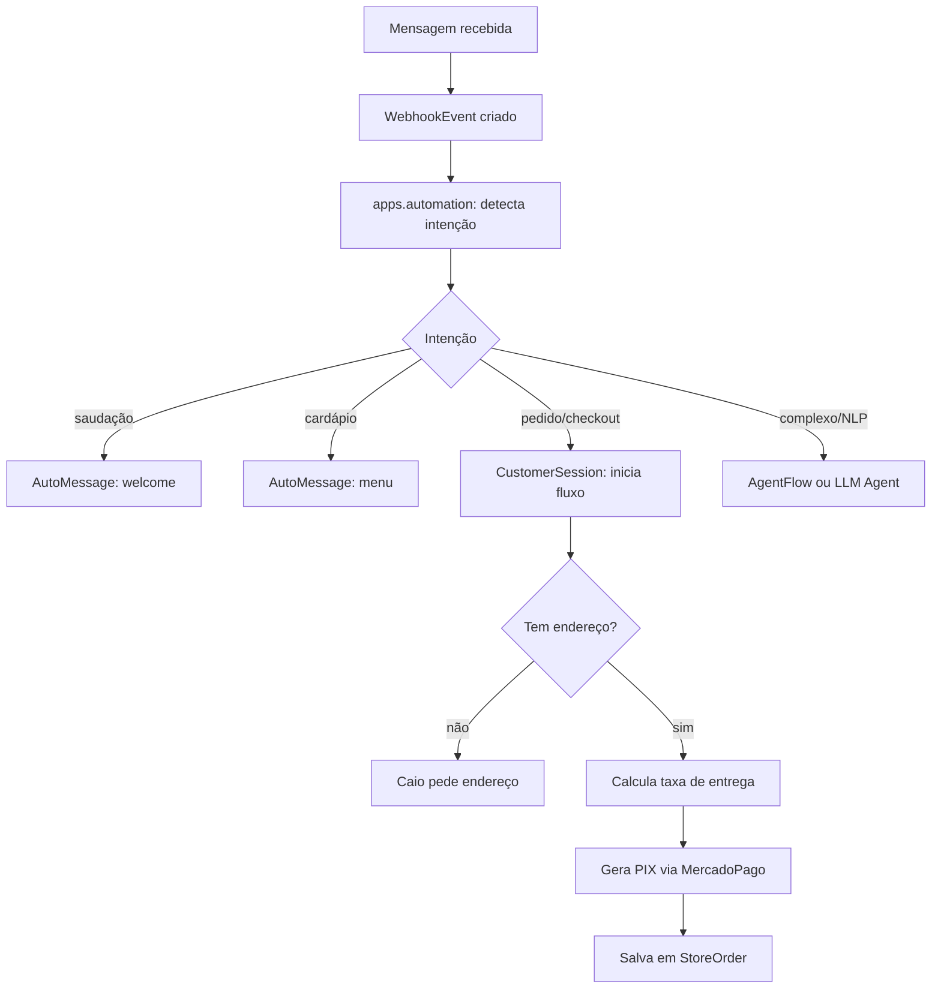
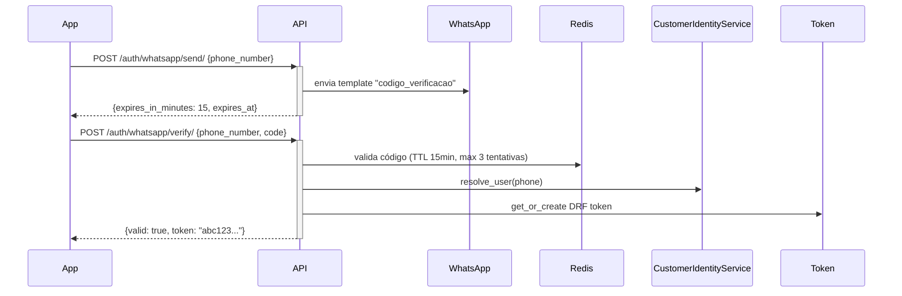

# Regras de Negócio — Pastita/server2

> Fonte de verdade para implementadores e agentes de IA.
> Atualizar sempre que uma regra mudar.

---

## 1. Ciclo de Vida do Pedido



**Regras:**
- `access_token` é UUID v4, imutável após criação. Permite acesso público ao pedido sem autenticação.
- `pix_code` e `pix_qr_code` vivem APENAS em `StoreOrder`. O `CustomerSession` NÃO deve duplicar esses campos.
- `payment_status` é independente de `status`. Um pedido `confirmed` pode ter `payment_status=pending` (ex: pagamento na entrega).
- Cancelamento: só permitido em `pending` ou `confirmed`. Pedidos em `preparing` ou além não podem ser cancelados via API.
- `order_number` é sequencial por loja, formato `LOJA-YYYYMMDD-NNNN`.

## 2. Carrinho e Checkout



**Regras:**
- Carrinho guest identificado por `X-Cart-Key` (UUID gerado no frontend, armazenado em localStorage).
- Carrinho autenticado tem FK `user`, mas também mantém `session_key` para compatibilidade.
- Carrinhos guest sem atividade por 30 dias são elegíveis para cleanup automático.
- Checkout valida `min_order_value` ANTES de processar pagamento.
- Cupom é validado no checkout; `coupon_code` é gravado no `StoreOrder` como snapshot.

## 3. Identificação do Cliente

**Hoje (problemático):**
```
WhatsApp → UnifiedUser (phone) ← CustomerSession
                ↕ (45/54 sem link)
auth_user ← UserProfile
    ↕
StoreCustomer (por loja)
```

**Regra atual (a respeitar até consolidação):**
- `StoreCustomer` é o perfil do cliente POR LOJA. Um cliente que compra em 2 lojas tem 2 `StoreCustomer`.
- `phone` é o identificador primário para clientes que chegam via WhatsApp.
- Email `{phone}@pastita.local` é email técnico interno — NUNCA exibir para o cliente.
- `StoreCustomer.user` (FK) é o `auth_user` Django. `StoreCustomer.unified_user` aponta para o `UnifiedUser` que agrega canais.
- O campo `StoreCustomer.addresses` (JSON) é DEPRECATED — usar tabela `StoreCustomerAddress`.

## 4. Endereços

**Regras:**
- `StoreCustomerAddress` é a fonte de verdade.
- `is_default=True` marca o endereço padrão. Só um endereço pode ser `is_default=True` por cliente. Garantir via signal ou constraint.
- `StoreCustomer.default_address_id` (FK pós-cleanup) aponta direto para `StoreCustomerAddress`.
- Endereços capturados no checkout são salvos automaticamente via `CustomerIdentityService.sync_checkout_customer`.
- `lat`/`lng` são preenchidos de forma lazy (geocodificados na primeira vez que a taxa de entrega for calculada).

## 5. Taxa de Entrega

```mermaid
flowchart TD
    A[Recebe distance_km OU lat/lng OU address/zip] --> B{Tem lat/lng?}
    B -- não --> C[Geocodifica via Google Maps]
    C --> D[Tem coordenadas]
    B -- sim --> D
    D --> E{Há StoreDeliveryZone ativa?}
    E -- sim --> F[Busca zona que contém distance_km]
    F --> G{Zona encontrada?}
    G -- sim --> H[Retorna delivery_fee da zona]
    G -- não --> I[Retorna unavailable]
    E -- não --> J[Usa cálculo dinâmico: base_fee + fee_per_km × max(0, dist - flat_km)]
```

**Regras:**
- Google Maps é o único provider de geocodificação. Não usar HERE Maps.
- `StoreDeliveryZone` é a fonte de verdade de zonas. `Store.default_delivery_fee` é fallback quando não há zonas.
- A taxa de entrega é SEMPRE calculada pelo backend. O Flutter/frontend nunca deve hardcodar valores.
- `delivery_fee` gravado no `StoreOrder` é snapshot imutável no momento do checkout.

## 6. Pagamento PIX (MercadoPago)



**Regras:**
- `pix_code` e `pix_qr_code` pertencem ao `StoreOrder`. O `CustomerSession` não deve duplicá-los.
- Webhook do MercadoPago é idempotente — reprocessar o mesmo evento não deve criar pagamento duplicado. Verificar `event_id` no `WebhookEvent`.
- `StorePayment` registra cada tentativa de pagamento. Um pedido pode ter múltiplos `StorePayment` (retrials).
- Credenciais de gateway ficam em `PaymentGateway` (pós-cleanup) ou `StoreIntegration` (hoje). Nunca em variável de ambiente hardcoded por loja.

## 7. WhatsApp — Pipeline de Automação



**Regras do Agente Caio:**
- Deve perguntar endereço/localização ANTES de calcular entrega.
- NÃO deve expor valores de taxa de entrega internamente (ex: "a taxa é R$8 porque você está a 4km").
- NÃO deve gerar PIX antes de ter itens claros no carrinho.
- Handover para humano quando: `CustomerSession.status = 'needs_human'` ou após 3 tentativas sem progresso.
- Bot está no modo automático quando `CompanyProfile.auto_reply_enabled = True` E `Conversation.mode = 'bot'`.

## 8. OTP WhatsApp



**Regras:**
- OTP usa template Meta `codigo_verificacao`. Não usar mensagem de texto livre fora da janela de 24h.
- Código expira em 15 minutos. Máximo 3 tentativas antes de bloquear.
- A resposta do `/send/` NUNCA inclui o código (nem em DEBUG=True na API — apenas no log).
- Email `@pastita.local` nunca aparece na resposta do `/verify/`.
- `_resolve_whatsapp_account_id`: usa `whatsapp_account_id` do request → `DEFAULT_WHATSAPP_ACCOUNT_ID` no settings → único WhatsAppAccount ativo no banco.

## 9. Webhook Central

**Regras:**
- Todo webhook recebido (WhatsApp, MercadoPago, Instagram) passa por `apps.webhooks.dispatcher`.
- HMAC-SHA256 validado na entrada. Payload rejeitado se assinatura inválida.
- `WebhookEvent.processing_status`: `pending` → `processed` | `failed` | `dead_letter`.
- Retry automático até 3 vezes com backoff exponencial para eventos `failed`.
- `dead_letter` = falhou todas as tentativas. Fica em `WebhookDeadLetter` para inspeção manual.
- (Pós-cleanup) `WebhookEvent` tem campo `channel` em vez de tabela por canal.

## 10. Ciclo de Vida do Carrinho

**Regras de cleanup:**
- Carrinho guest (`user=NULL`) com `updated_at > 30 dias` → elegível para DELETE.
- Carrinho autenticado com `updated_at > 90 dias` → elegível para DELETE.
- Carrinho com `is_active=False` (checkout feito) → elegível para DELETE imediato após 7 dias.
- O job `cleanup_carts` roda diariamente via Celery Beat.
- NUNCA deletar carrinho com `is_active=True` e `updated_at < 30 dias` (usuário pode estar ativo).
