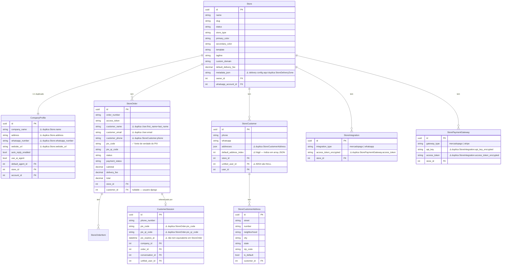
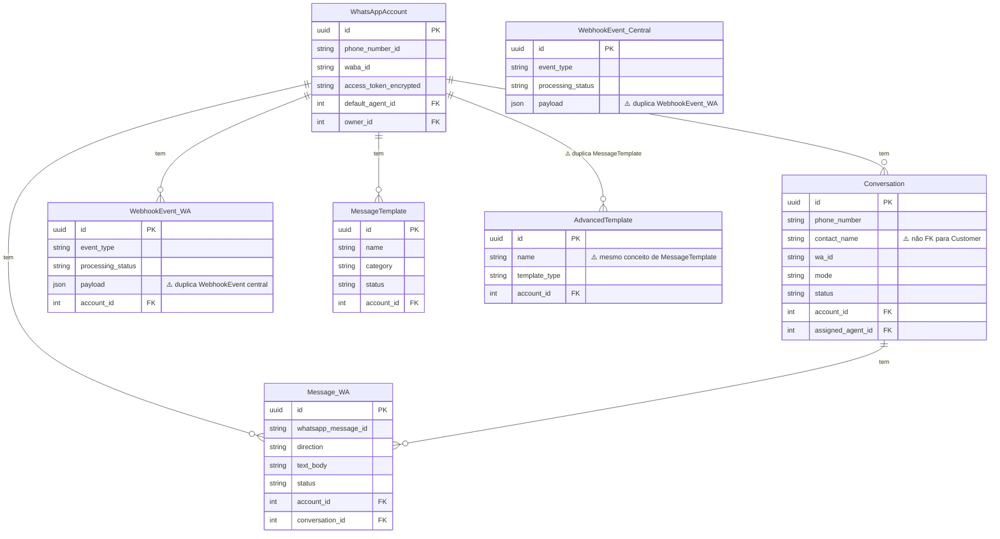

# Schema Atual — Pastita/server2

> Gerado em 2026-05-26. Reflete o estado ANTES do cleanup.

## ERD — Domínio E-commerce

## ERD — Domínio Mensageria

## Inventário de Redundâncias

| # | Redundância | Impacto | Prioridade |
|---|---|---|---|
| R1 | `CompanyProfile` duplica `Store` (name, address, whatsapp, website) | Dados divergentes em prod | 🔴 Alta |
| R2 | `pix_code/pix_qr_code` em `CustomerSession` E `StoreOrder` | Fonte de verdade ambígua do PIX | 🔴 Alta |
| R3 | `StoreCustomer.addresses` JSON E `StoreCustomerAddress` tabela | Sincronização manual, bug-prone | 🔴 Alta |
| R4 | `StoreIntegration` E `StorePaymentGateway` para MercadoPago | Credenciais em dois lugares | 🟡 Média |
| R5 | `whatsapp_webhook_events` E `webhook_events` (central) | 7.681 + 13.024 = duplicados | 🟡 Média |
| R6 | `MessageTemplate` E `AdvancedTemplate` | Mesma entidade, dois modelos | 🟡 Média |
| R7 | `StoreOrder.customer_name/email/phone` quando FK `customer` existe | Campos denormalizados divergem | 🟢 Baixa |
| R8 | `unified_users` 340 registros, 285 sem `django_user` | Identidade fragmentada | 🔴 Alta |
| R9 | 3.426 carrinhos guest > 7 dias | Performance, storage | 🟡 Média |
| R10 | `Store.metadata` JSON para config de delivery | Deveria ser StoreDeliveryConfig | 🟢 Baixa |
