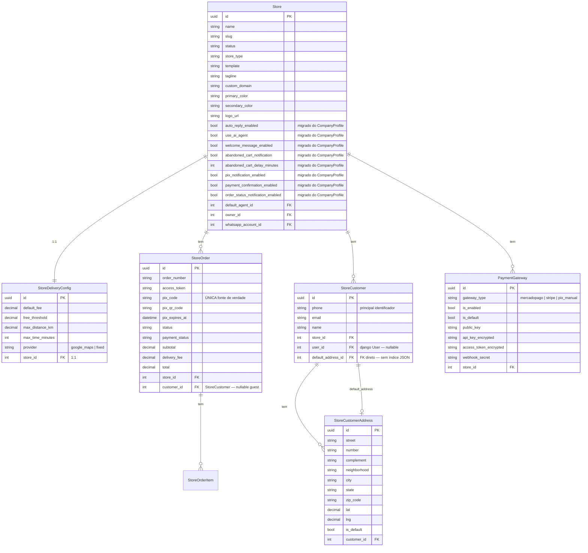
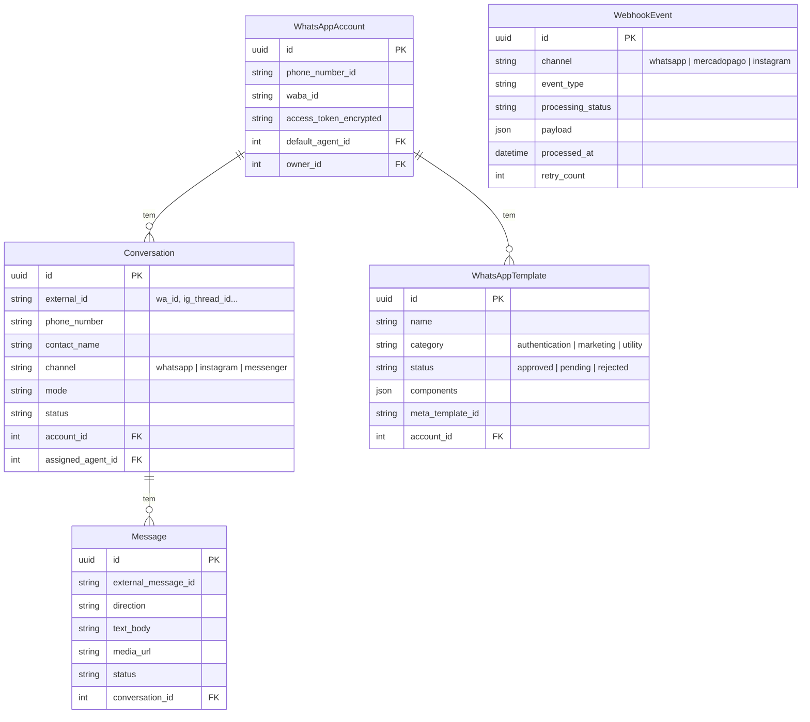

# Schema Target — Pastita/server2

> Estado alvo após execução completa deste plano.
> A consolidação de identidade (Customer único) é sub-projeto separado.

## ERD — Domínio E-commerce (Target)

## ERD — Domínio Mensageria (Target)

## Princípios do Schema Limpo

1. **Uma fonte de verdade por dado** — PIX fica só em `StoreOrder`. Endereços só em `StoreCustomerAddress`. Config de automação só em `Store`.
2. **FKs tipadas em vez de índices em arrays JSON** — `StoreCustomer.default_address_id` aponta para linha, não `addresses[default_address_index]`.
3. **Webhook único por canal** — `WebhookEvent` com campo `channel` em vez de tabela por canal.
4. **Templates unificados** — `WhatsAppTemplate` absorve `AdvancedTemplate`.
5. **PaymentGateway único** — `StoreIntegration` guarda integrações não-payment; `PaymentGateway` guarda payment com credenciais.
6. **CompanyProfile extinto** — campos de automação migram para `Store`.
