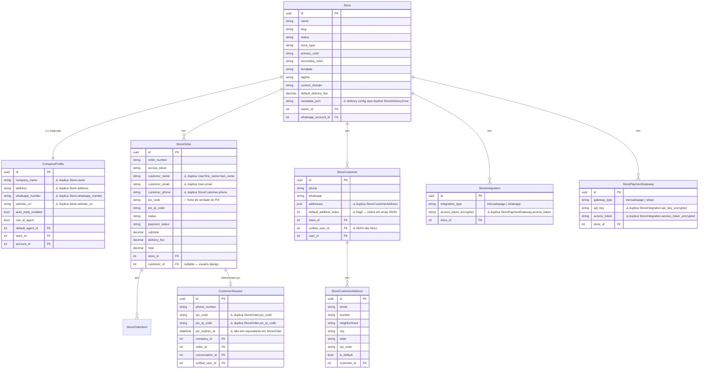
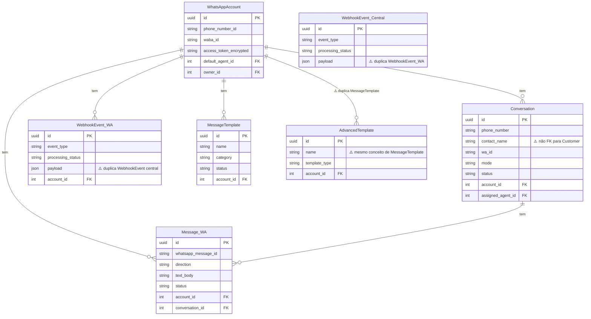
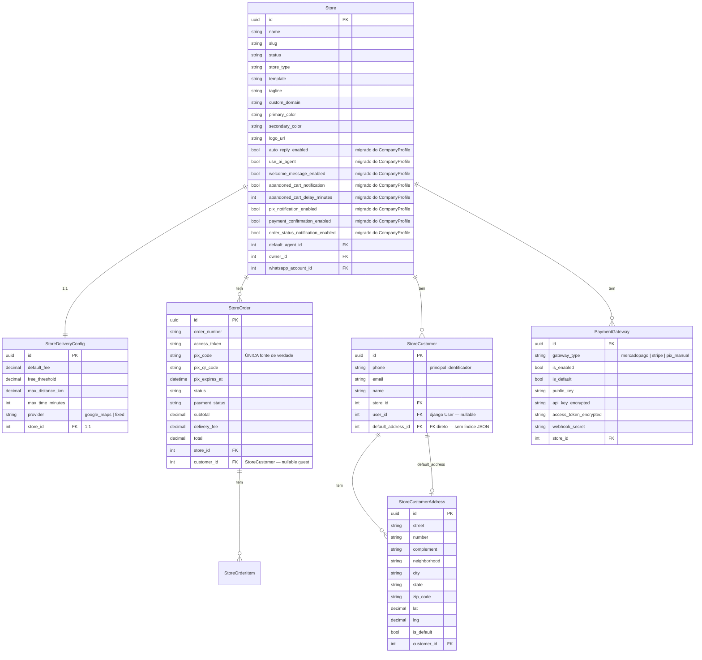
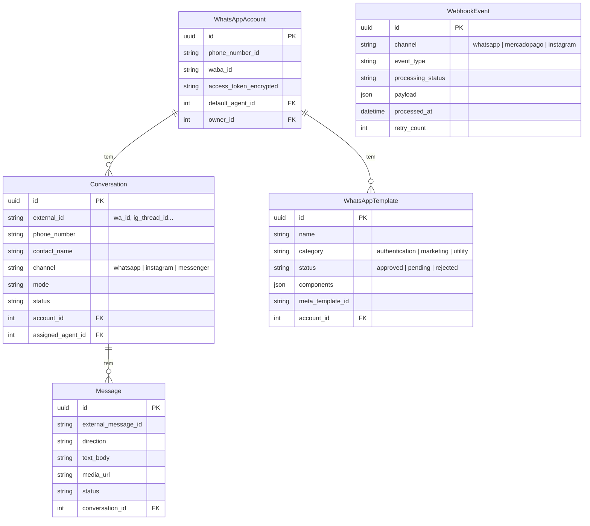
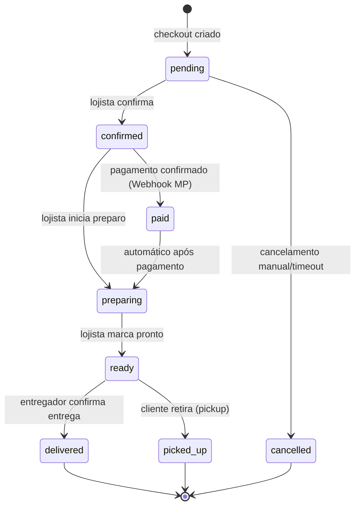
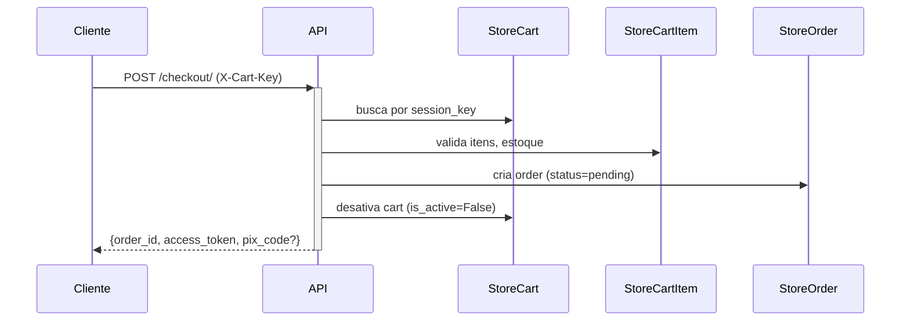
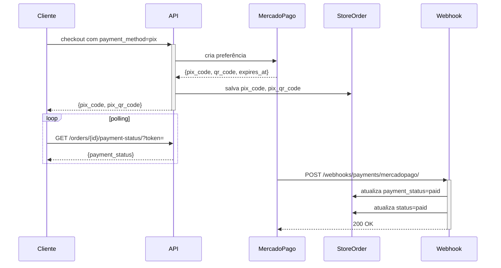
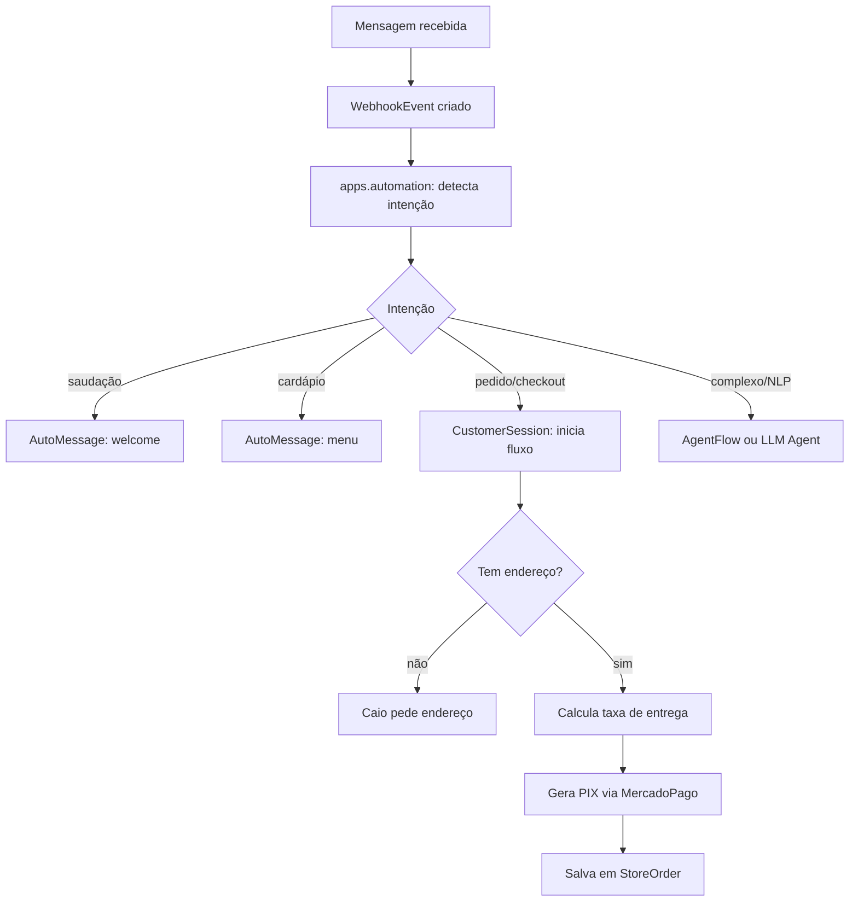
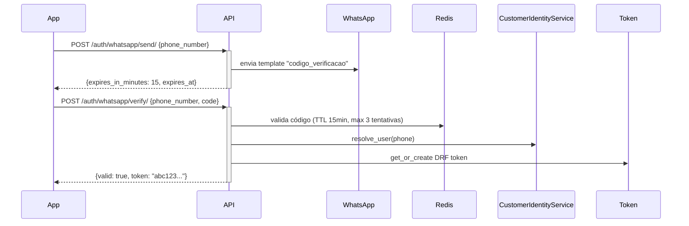

# Schema Cleanup, UML e Regras de Negócio — Implementation Plan

> **For agentic workers:** REQUIRED SUB-SKILL: Use superpowers:subagent-driven-development (recommended) or superpowers:executing-plans to implement this plan task-by-task. Steps use checkbox (`- [ ]`) syntax for tracking.

**Goal:** Eliminar redundâncias críticas do schema do server2, documentar UML e regras de negócio em Mermaid, e deixar o banco com um contrato limpo e sem ambiguidade de fonte de verdade.

**Architecture:** Execução em fases independentes — cada fase produz um deploy funcional. Começamos por documentação (sem risco), depois limpeza de dados, depois unificação de tabelas, depois colapso do CompanyProfile. A consolidação de identidade (Customer unificado) é o sub-projeto separado mais complexo e fica para um plano próprio após este.

**Tech Stack:** Django 4 + DRF, PostgreSQL 16, Celery, Docker. Testes rodam dentro do container via `docker exec pastita_web python manage.py test <app> --keepdb`. Migrações via `make migrate` ou `docker exec pastita_web python manage.py migrate`.

---

## Mapa de Arquivos

### Criados neste plano

| Arquivo | Responsabilidade |
|---|---|
| `docs/schema/SCHEMA_ATUAL.md` | ERD Mermaid + inventário de redundâncias |
| `docs/schema/SCHEMA_TARGET.md` | ERD Mermaid do schema limpo alvo |
| `docs/schema/BUSINESS_RULES.md` | Regras de negócio de todos os domínios |
| `apps/stores/management/commands/cleanup_carts.py` | Cleanup de carrinhos guest >30 dias |
| `apps/automation/management/__init__.py` | Pacote |
| `apps/automation/management/commands/__init__.py` | Pacote |
| `apps/automation/management/commands/cleanup_unified_users.py` | Apaga UnifiedUsers órfãos |
| `apps/stores/migrations/XXXX_remove_pix_from_customer_session.py` | Remove pix_code/pix_qr_code do CustomerSession |
| `apps/stores/migrations/XXXX_normalize_customer_addresses.py` | Migração de dados: JSON → StoreCustomerAddress |
| `apps/whatsapp/migrations/XXXX_merge_webhook_events.py` | Unifica whatsapp_webhook_events → webhook_events |
| `apps/whatsapp/migrations/XXXX_drop_advanced_templates.py` | Apaga whatsapp_advanced_templates |
| `apps/stores/migrations/XXXX_merge_payment_gateway.py` | Unifica StoreIntegration payment + StorePaymentGateway |
| `apps/automation/migrations/XXXX_collapse_company_profile.py` | Move campos úteis para Store, depreca CompanyProfile |

### Modificados neste plano

| Arquivo | Mudança |
|---|---|
| `apps/automation/models.py` | Remove pix_code/pix_qr_code/pix_expires_at do CustomerSession |
| `apps/stores/models/customer.py` | Depreca campo `addresses` (JSON); remove `default_address_index` |
| `apps/stores/models/base.py` | Adiciona campos de automação vindos do CompanyProfile |
| `apps/whatsapp/models.py` | Remove WhatsAppWebhookEvent em favor de webhook central |
| `config/celery.py` | Adiciona beat task `cleanup-carts` diário |
| `apps/automation/signals.py` | Atualiza signal de CompanyProfile |

---

## Task 0: Documentação — Schema Atual (ERD + Redundâncias)

**Files:**
- Create: `docs/schema/SCHEMA_ATUAL.md`

- [ ] **Step 1: Criar o diretório**

```bash
mkdir -p /home/graco/WORK/server2/docs/schema
```

- [ ] **Step 2: Criar SCHEMA_ATUAL.md com ERD Mermaid completo**

Criar `/home/graco/WORK/server2/docs/schema/SCHEMA_ATUAL.md` com o conteúdo abaixo (copiar literalmente):

```markdown
# Schema Atual — Pastita/server2

> Gerado em 2026-05-26. Reflete o estado ANTES do cleanup.

## ERD — Domínio E-commerce



## ERD — Domínio Mensageria



## Inventário de Redundâncias

| # | Redundância | Impacto | Prioridade |
|---|---|---|---|
| R1 | `CompanyProfile` duplica `Store` (name, address, whatsapp, website) | Dados divergentes em prod | 🔴 Alta |
| R2 | `pix_code/pix_qr_code` em `CustomerSession` E `StoreOrder` | Fonte de verdade ambígua do PIX | 🔴 Alta |
| R3 | `StoreCustomer.addresses` JSON E `StoreCustomerAddress` tabela | Sincronização manual, bug-prone | 🔴 Alta |
| R4 | `StoreIntegration` E `StorePaymentGateway` para MercadoPago | Credenciais em dois lugares | 🟡 Média |
| R5 | `whatsapp_webhook_events` E `webhook_events` (central) | 7.681 + 13.024 = duplicados | 🟡 Média |
| R6 | `MessageTemplate` E `AdvancedTemplate` | Mesma entidade, dois modelos | 🟡 Média |
| R7 | `StoreOrder.customer_name/email/phone` quando FK `customer` existe | Campos denormalizados divergem | 🟢 Baixa |
| R8 | `unified_users` 340 registros, 285 sem `django_user` | Identidade fragmentada | 🔴 Alta |
| R9 | 3.426 carrinhos guest > 7 dias | Performance, storage | 🟡 Média |
| R10 | `Store.metadata` JSON para config de delivery | Deveria ser StoreDeliveryConfig | 🟢 Baixa |
```

- [ ] **Step 3: Commit**

```bash
cd /home/graco/WORK/server2
git add docs/schema/SCHEMA_ATUAL.md
git commit -m "docs: schema atual com ERD Mermaid e inventário de redundâncias"
```

---

## Task 1: Documentação — Schema Target (ERD limpo)

**Files:**
- Create: `docs/schema/SCHEMA_TARGET.md`

- [ ] **Step 1: Criar SCHEMA_TARGET.md**

Criar `/home/graco/WORK/server2/docs/schema/SCHEMA_TARGET.md`:

```markdown
# Schema Target — Pastita/server2

> Estado alvo após execução completa deste plano.
> A consolidação de identidade (Customer único) é sub-projeto separado.

## ERD — Domínio E-commerce (Target)



## ERD — Domínio Mensageria (Target)



## Princípios do Schema Limpo

1. **Uma fonte de verdade por dado** — PIX fica só em `StoreOrder`. Endereços só em `StoreCustomerAddress`. Config de automação só em `Store`.
2. **FKs tipadas em vez de índices em arrays JSON** — `StoreCustomer.default_address_id` aponta para linha, não `addresses[default_address_index]`.
3. **Webhook único por canal** — `WebhookEvent` com campo `channel` em vez de tabela por canal.
4. **Templates unificados** — `WhatsAppTemplate` absorve `AdvancedTemplate`.
5. **PaymentGateway único** — `StoreIntegration` guarda integrações não-payment; `PaymentGateway` guarda payment com credenciais.
6. **CompanyProfile extinto** — campos de automação migram para `Store`.
```

- [ ] **Step 2: Commit**

```bash
git add docs/schema/SCHEMA_TARGET.md
git commit -m "docs: schema target com ERD Mermaid limpo pós-cleanup"
```

---

## Task 2: Documentação — Regras de Negócio

**Files:**
- Create: `docs/schema/BUSINESS_RULES.md`

- [ ] **Step 1: Criar BUSINESS_RULES.md**

Criar `/home/graco/WORK/server2/docs/schema/BUSINESS_RULES.md`:

```markdown
# Regras de Negócio — Pastita/server2

> Fonte de verdade para implementadores e agentes de IA.
> Atualizar sempre que uma regra mudar.

---

## 1. Ciclo de Vida do Pedido



**Regras:**
- `access_token` é UUID v4, imutável após criação. Permite acesso público ao pedido sem autenticação.
- `pix_code` e `pix_qr_code` vivem APENAS em `StoreOrder`. O `CustomerSession` NÃO deve duplicar esses campos.
- `payment_status` é independente de `status`. Um pedido `confirmed` pode ter `payment_status=pending` (ex: pagamento na entrega).
- Cancelamento: só permitido em `pending` ou `confirmed`. Pedidos em `preparing` ou além não podem ser cancelados via API.
- `order_number` é sequencial por loja, formato `LOJA-YYYYMMDD-NNNN`.

## 2. Carrinho e Checkout



**Regras:**
- Carrinho guest identificado por `X-Cart-Key` (UUID gerado no frontend, armazenado em localStorage).
- Carrinho autenticado tem FK `user`, mas também mantém `session_key` para compatibilidade.
- Carrinhos guest sem atividade por 30 dias são elegíveis para cleanup automático.
- Checkout valida `min_order_value` ANTES de processar pagamento.
- Cupom é validado no checkout; `coupon_code` é gravado no `StoreOrder` como snapshot.

## 3. Identificação do Cliente

**Hoje (problemático):**
```
WhatsApp → UnifiedUser (phone) ← CustomerSession
                ↕ (45/54 sem link)
auth_user ← UserProfile
    ↕
StoreCustomer (por loja)
```

**Regra atual (a respeitar até consolidação):**
- `StoreCustomer` é o perfil do cliente POR LOJA. Um cliente que compra em 2 lojas tem 2 `StoreCustomer`.
- `phone` é o identificador primário para clientes que chegam via WhatsApp.
- Email `{phone}@pastita.local` é email técnico interno — NUNCA exibir para o cliente.
- `StoreCustomer.user` (FK) é o `auth_user` Django. `StoreCustomer.unified_user` aponta para o `UnifiedUser` que agrega canais.
- O campo `StoreCustomer.addresses` (JSON) é DEPRECATED — usar tabela `StoreCustomerAddress`.

## 4. Endereços

**Regras:**
- `StoreCustomerAddress` é a fonte de verdade.
- `is_default=True` marca o endereço padrão. Só um endereço pode ser `is_default=True` por cliente. Garantir via signal ou constraint.
- `StoreCustomer.default_address_id` (FK pós-cleanup) aponta direto para `StoreCustomerAddress`.
- Endereços capturados no checkout são salvos automaticamente via `CustomerIdentityService.sync_checkout_customer`.
- `lat`/`lng` são preenchidos de forma lazy (geocodificados na primeira vez que a taxa de entrega for calculada).

## 5. Taxa de Entrega

```mermaid
flowchart TD
    A[Recebe distance_km OU lat/lng OU address/zip] --> B{Tem lat/lng?}
    B -- não --> C[Geocodifica via Google Maps]
    C --> D[Tem coordenadas]
    B -- sim --> D
    D --> E{Há StoreDeliveryZone ativa?}
    E -- sim --> F[Busca zona que contém distance_km]
    F --> G{Zona encontrada?}
    G -- sim --> H[Retorna delivery_fee da zona]
    G -- não --> I[Retorna unavailable]
    E -- não --> J[Usa cálculo dinâmico: base_fee + fee_per_km × max(0, dist - flat_km)]
```

**Regras:**
- Google Maps é o único provider de geocodificação. Não usar HERE Maps.
- `StoreDeliveryZone` é a fonte de verdade de zonas. `Store.default_delivery_fee` é fallback quando não há zonas.
- A taxa de entrega é SEMPRE calculada pelo backend. O Flutter/frontend nunca deve hardcodar valores.
- `delivery_fee` gravado no `StoreOrder` é snapshot imutável no momento do checkout.

## 6. Pagamento PIX (MercadoPago)



**Regras:**
- `pix_code` e `pix_qr_code` pertencem ao `StoreOrder`. O `CustomerSession` não deve duplicá-los.
- Webhook do MercadoPago é idempotente — reprocessar o mesmo evento não deve criar pagamento duplicado. Verificar `event_id` no `WebhookEvent`.
- `StorePayment` registra cada tentativa de pagamento. Um pedido pode ter múltiplos `StorePayment` (retrials).
- Credenciais de gateway ficam em `PaymentGateway` (pós-cleanup) ou `StoreIntegration` (hoje). Nunca em variável de ambiente hardcoded por loja.

## 7. WhatsApp — Pipeline de Automação



**Regras do Agente Caio:**
- Deve perguntar endereço/localização ANTES de calcular entrega.
- NÃO deve expor valores de taxa de entrega internamente (ex: "a taxa é R$8 porque você está a 4km").
- NÃO deve gerar PIX antes de ter itens claros no carrinho.
- Handover para humano quando: `CustomerSession.status = 'needs_human'` ou após 3 tentativas sem progresso.
- Bot está no modo automático quando `CompanyProfile.auto_reply_enabled = True` E `Conversation.mode = 'bot'`.

## 8. OTP WhatsApp



**Regras:**
- OTP usa template Meta `codigo_verificacao`. Não usar mensagem de texto livre fora da janela de 24h.
- Código expira em 15 minutos. Máximo 3 tentativas antes de bloquear.
- A resposta do `/send/` NUNCA inclui o código (nem em DEBUG=True na API — apenas no log).
- Email `@pastita.local` nunca aparece na resposta do `/verify/`.
- `_resolve_whatsapp_account_id`: usa `whatsapp_account_id` do request → `DEFAULT_WHATSAPP_ACCOUNT_ID` no settings → único WhatsAppAccount ativo no banco.

## 9. Webhook Central

**Regras:**
- Todo webhook recebido (WhatsApp, MercadoPago, Instagram) passa por `apps.webhooks.dispatcher`.
- HMAC-SHA256 validado na entrada. Payload rejeitado se assinatura inválida.
- `WebhookEvent.processing_status`: `pending` → `processed` | `failed` | `dead_letter`.
- Retry automático até 3 vezes com backoff exponencial para eventos `failed`.
- `dead_letter` = falhou todas as tentativas. Fica em `WebhookDeadLetter` para inspeção manual.
- (Pós-cleanup) `WebhookEvent` tem campo `channel` em vez de tabela por canal.

## 10. Ciclo de Vida do Carrinho

**Regras de cleanup:**
- Carrinho guest (`user=NULL`) com `updated_at > 30 dias` → elegível para DELETE.
- Carrinho autenticado com `updated_at > 90 dias` → elegível para DELETE.
- Carrinho com `is_active=False` (checkout feito) → elegível para DELETE imediato após 7 dias.
- O job `cleanup_carts` roda diariamente via Celery Beat.
- NUNCA deletar carrinho com `is_active=True` e `updated_at < 30 dias` (usuário pode estar ativo).
```

- [ ] **Step 2: Commit**

```bash
git add docs/schema/BUSINESS_RULES.md
git commit -m "docs: regras de negócio — pedido, carrinho, identidade, entrega, PIX, OTP, WhatsApp"
```

---

## Task 3: Cleanup de Carrinhos — Management Command

**Files:**
- Create: `apps/stores/management/__init__.py`
- Create: `apps/stores/management/commands/__init__.py`
- Create: `apps/stores/management/commands/cleanup_carts.py`
- Create: `apps/stores/tests/test_cleanup_carts.py`

- [ ] **Step 1: Verificar se management já existe**

```bash
ls apps/stores/management/ 2>/dev/null || echo "NAO EXISTE"
```

- [ ] **Step 2: Criar pacotes e comando**

```bash
mkdir -p apps/stores/management/commands
touch apps/stores/management/__init__.py
touch apps/stores/management/commands/__init__.py
```

Criar `apps/stores/management/commands/cleanup_carts.py`:

```python
from django.core.management.base import BaseCommand
from django.utils import timezone
from datetime import timedelta
from apps.stores.models import StoreCart


class Command(BaseCommand):
    help = 'Remove carrinhos guest abandonados e carrinhos inativos antigos'

    def add_arguments(self, parser):
        parser.add_argument('--guest-days', type=int, default=30,
                            help='Deletar carrinhos guest mais antigos que N dias (default: 30)')
        parser.add_argument('--auth-days', type=int, default=90,
                            help='Deletar carrinhos autenticados mais antigos que N dias (default: 90)')
        parser.add_argument('--inactive-days', type=int, default=7,
                            help='Deletar carrinhos is_active=False mais antigos que N dias (default: 7)')
        parser.add_argument('--dry-run', action='store_true',
                            help='Apenas conta, não deleta')

    def handle(self, *args, **options):
        now = timezone.now()
        guest_cutoff = now - timedelta(days=options['guest_days'])
        auth_cutoff = now - timedelta(days=options['auth_days'])
        inactive_cutoff = now - timedelta(days=options['inactive_days'])

        guest_qs = StoreCart.objects.filter(
            user__isnull=True,
            is_active=True,
            updated_at__lt=guest_cutoff,
        )
        auth_qs = StoreCart.objects.filter(
            user__isnull=False,
            is_active=True,
            updated_at__lt=auth_cutoff,
        )
        inactive_qs = StoreCart.objects.filter(
            is_active=False,
            updated_at__lt=inactive_cutoff,
        )

        total = guest_qs.count() + auth_qs.count() + inactive_qs.count()

        self.stdout.write(f'Carrinhos guest >{options["guest_days"]}d: {guest_qs.count()}')
        self.stdout.write(f'Carrinhos auth >{options["auth_days"]}d: {auth_qs.count()}')
        self.stdout.write(f'Carrinhos inativos >{options["inactive_days"]}d: {inactive_qs.count()}')
        self.stdout.write(f'Total elegível: {total}')

        if options['dry_run']:
            self.stdout.write(self.style.WARNING('DRY RUN — nada deletado'))
            return

        deleted_guest, _ = guest_qs.delete()
        deleted_auth, _ = auth_qs.delete()
        deleted_inactive, _ = inactive_qs.delete()
        total_deleted = deleted_guest + deleted_auth + deleted_inactive

        self.stdout.write(self.style.SUCCESS(f'Deletados: {total_deleted} carrinhos'))
```

- [ ] **Step 3: Escrever o teste antes de rodar**

Criar `apps/stores/tests/test_cleanup_carts.py`:

```python
from datetime import timedelta
from io import StringIO

from django.contrib.auth import get_user_model
from django.core.management import call_command
from django.test import TestCase
from django.utils import timezone

from apps.stores.models import Store, StoreCart

User = get_user_model()


class CleanupCartsCommandTest(TestCase):
    def setUp(self):
        self.owner = User.objects.create_user(username='cart-cleanup-owner', password='x')
        self.store = Store.objects.create(
            name='Cleanup Store', slug='cleanup-store',
            owner=self.owner, status='active', store_type='food',
        )

    def _cart(self, user=None, is_active=True, days_old=0):
        cart = StoreCart.objects.create(store=self.store, user=user, is_active=is_active)
        StoreCart.objects.filter(pk=cart.pk).update(
            updated_at=timezone.now() - timedelta(days=days_old)
        )
        return cart

    def test_dry_run_nao_deleta(self):
        self._cart(user=None, days_old=40)
        out = StringIO()
        call_command('cleanup_carts', '--dry-run', stdout=out)
        self.assertEqual(StoreCart.objects.count(), 1)
        self.assertIn('DRY RUN', out.getvalue())

    def test_deleta_guest_antigo(self):
        self._cart(user=None, days_old=31)   # deve ser deletado
        self._cart(user=None, days_old=10)   # deve ficar
        call_command('cleanup_carts', '--guest-days=30', stdout=StringIO())
        self.assertEqual(StoreCart.objects.count(), 1)

    def test_deleta_inativo_antigo(self):
        self._cart(is_active=False, days_old=8)  # deve ser deletado
        self._cart(is_active=False, days_old=3)  # deve ficar
        call_command('cleanup_carts', '--inactive-days=7', stdout=StringIO())
        self.assertEqual(StoreCart.objects.count(), 1)

    def test_nao_deleta_carrinho_ativo_recente(self):
        self._cart(user=None, days_old=5, is_active=True)
        call_command('cleanup_carts', stdout=StringIO())
        self.assertEqual(StoreCart.objects.count(), 1)
```

- [ ] **Step 4: Copiar e rodar o teste no container**

```bash
docker cp apps/stores/management/ pastita_web:/app/apps/stores/
docker cp apps/stores/tests/test_cleanup_carts.py pastita_web:/app/apps/stores/tests/test_cleanup_carts.py
docker exec pastita_web python manage.py test apps.stores.tests.test_cleanup_carts --keepdb -v 2
```

Esperado: `Ran 4 tests ... OK`

- [ ] **Step 5: Rodar em dry-run no banco de produção**

```bash
docker exec pastita_web python manage.py cleanup_carts --dry-run
```

Esperado: mostra contagens sem deletar nada.

- [ ] **Step 6: Executar cleanup real**

```bash
docker exec pastita_web python manage.py cleanup_carts
```

- [ ] **Step 7: Adicionar Celery Beat task**

Em `config/celery.py`, localizar `beat_schedule` e adicionar:

```python
'cleanup-abandoned-carts': {
    'task': 'apps.stores.tasks.cleanup_abandoned_carts',
    'schedule': crontab(hour=3, minute=0),  # 3h da manhã todo dia
},
```

Em `apps/stores/tasks.py`, adicionar:

```python
@shared_task(name='apps.stores.tasks.cleanup_abandoned_carts')
def cleanup_abandoned_carts():
    from django.core.management import call_command
    from io import StringIO
    out = StringIO()
    call_command('cleanup_carts', stdout=out)
    return out.getvalue()
```

- [ ] **Step 8: Commit**

```bash
git add apps/stores/management/ apps/stores/tests/test_cleanup_carts.py apps/stores/tasks.py config/celery.py
git commit -m "feat: management command cleanup_carts + Celery Beat daily task"
```

---

## Task 4: PIX — Remover do CustomerSession

**Files:**
- Modify: `apps/automation/models.py` (remove pix_code, pix_qr_code, pix_expires_at do CustomerSession)
- Create: migration de schema

**Precondição:** Confirmar que o código não lê `session.pix_code` para exibição — ele só lê de `session.order.pix_code`.

- [ ] **Step 1: Mapear todos os usos de pix_code no CustomerSession**

```bash
grep -rn "session\.pix_code\|session\.pix_qr\|CustomerSession.*pix\|pix_code.*session" \
    apps/ --include="*.py" | grep -v __pycache__ | grep -v migration
```

Para cada ocorrência: verificar se é escrita (OK para remover) ou leitura (precisa de migração de chamada).

- [ ] **Step 2: Escrever testes que confirmam que PIX vem de StoreOrder**

Criar `tests/test_pix_source_of_truth.py`:

```python
from decimal import Decimal
from django.test import TestCase
from rest_framework.test import APIClient
from django.contrib.auth import get_user_model
from apps.stores.models import Store, StoreOrder, StoreOrderItem, StoreProduct, StoreCategory

User = get_user_model()


class PixSourceOfTruthTest(TestCase):
    """PIX deve vir de StoreOrder, nunca de CustomerSession."""

    def setUp(self):
        self.client = APIClient()
        self.owner = User.objects.create_user(username='pix-owner', password='x')
        self.store = Store.objects.create(
            name='PIX Test', slug='pix-test', owner=self.owner,
            status='active', store_type='food',
        )
        category = StoreCategory.objects.create(
            store=self.store, name='Cat', slug='cat', is_active=True, sort_order=1,
        )
        self.product = StoreProduct.objects.create(
            store=self.store, category=category, name='Prod', slug='prod',
            price=Decimal('10.00'), status='active', track_stock=False,
        )

    def test_payment_status_endpoint_lê_de_order_nao_session(self):
        order = StoreOrder.objects.create(
            store=self.store,
            order_number='PIX-001',
            customer_name='Test',
            customer_email='t@t.com',
            customer_phone='+5563999999999',
            subtotal=Decimal('10.00'),
            delivery_fee=Decimal('0.00'),
            total=Decimal('10.00'),
            delivery_method='pickup',
            payment_method='pix',
            pix_code='00020126...',
            pix_qr_code='iVBOR...',
        )
        StoreOrderItem.objects.create(
            order=order, product=self.product,
            product_name='Prod', unit_price=Decimal('10.00'),
            quantity=1, subtotal=Decimal('10.00'),
        )
        response = self.client.get(
            f'/api/v1/stores/orders/{order.id}/payment-status/',
            {'token': order.access_token},
        )
        self.assertEqual(response.status_code, 200)
        # O pix_code na resposta vem do StoreOrder
        payload = response.json()
        self.assertIn('status', payload)
```

```bash
docker cp tests/test_pix_source_of_truth.py pastita_web:/app/tests/test_pix_source_of_truth.py
docker exec pastita_web python tests/test_pix_source_of_truth.py -v
```

- [ ] **Step 3: Remover campos do model CustomerSession**

Em `apps/automation/models.py`, localizar a classe `CustomerSession` e remover:

```python
# REMOVER ESTAS LINHAS:
pix_code = models.TextField(blank=True)
pix_qr_code = models.TextField(blank=True)
# pix_expires_at se existir também
```

- [ ] **Step 4: Gerar migration**

```bash
docker exec pastita_web python manage.py makemigrations automation --name remove_pix_from_customer_session
```

- [ ] **Step 5: Conferir SQL antes de aplicar**

```bash
docker exec pastita_web python manage.py sqlmigrate automation <numero_migration>
```

Esperado: `ALTER TABLE customer_sessions DROP COLUMN pix_code; DROP COLUMN pix_qr_code;`

- [ ] **Step 6: Aplicar migration**

```bash
docker exec pastita_web python manage.py migrate automation
```

- [ ] **Step 7: Rodar suíte de smoke contracts**

```bash
docker exec pastita_web python manage.py test apps.stores.tests.test_smoke_contracts --keepdb
```

Esperado: todos passando.

- [ ] **Step 8: Commit**

```bash
docker cp pastita_web:/app/apps/automation/migrations/ apps/automation/migrations/
git add apps/automation/models.py apps/automation/migrations/ tests/test_pix_source_of_truth.py
git commit -m "refactor: remove pix_code/pix_qr_code do CustomerSession — fonte de verdade é StoreOrder"
```

---

## Task 5: Endereços — Normalizar JSON → StoreCustomerAddress

**Files:**
- Modify: `apps/stores/models/customer.py` (deprecar campo `addresses`, adicionar `default_address FK`)
- Create: migration de dados + schema

- [ ] **Step 1: Verificar estado atual do campo addresses**

```bash
docker exec pastita_web python manage.py shell -c "
from apps.stores.models import StoreCustomer
qs = StoreCustomer.objects.exclude(addresses=[]).exclude(addresses__isnull=True)
print(f'Customers com JSON addresses: {qs.count()}')
for c in qs[:3]:
    print(c.phone, len(c.addresses), 'enderecos')
"
```

- [ ] **Step 2: Escrever teste de migração de dados**

Criar `tests/test_address_normalization.py`:

```python
from django.test import TestCase
from django.contrib.auth import get_user_model
from apps.stores.models import Store, StoreCustomer, StoreCustomerAddress

User = get_user_model()


class AddressNormalizationTest(TestCase):
    def setUp(self):
        self.owner = User.objects.create_user(username='addr-owner', password='x')
        self.store = Store.objects.create(
            name='Addr Test', slug='addr-test', owner=self.owner,
            status='active', store_type='food',
        )
        self.user = User.objects.create_user(username='addr-user', password='x')

    def test_customer_address_table_is_source_of_truth(self):
        customer = StoreCustomer.objects.create(
            store=self.store, user=self.user, phone='5563999999999',
        )
        addr = StoreCustomerAddress.objects.create(
            customer=customer,
            street='Rua das Saladas',
            number='42',
            neighborhood='Plano Diretor Sul',
            city='Palmas',
            state='TO',
            zip_code='77020026',
            is_default=True,
        )
        default = StoreCustomerAddress.objects.filter(
            customer=customer, is_default=True,
        ).first()
        self.assertIsNotNone(default)
        self.assertEqual(default.street, 'Rua das Saladas')

    def test_apenas_um_endereco_default_por_customer(self):
        customer = StoreCustomer.objects.create(
            store=self.store, user=self.user, phone='5563888888888',
        )
        StoreCustomerAddress.objects.create(
            customer=customer, street='Rua A', number='1',
            city='Palmas', state='TO', zip_code='77000000', is_default=True,
        )
        StoreCustomerAddress.objects.create(
            customer=customer, street='Rua B', number='2',
            city='Palmas', state='TO', zip_code='77000001', is_default=True,
        )
        # Deve haver lógica de signal para garantir apenas 1 is_default
        # Este teste documenta o comportamento esperado
        defaults = StoreCustomerAddress.objects.filter(customer=customer, is_default=True)
        self.assertEqual(defaults.count(), 1)
```

- [ ] **Step 3: Criar management command de migração de dados**

Criar `apps/stores/management/commands/migrate_addresses_json.py`:

```python
from django.core.management.base import BaseCommand
from apps.stores.models import StoreCustomer, StoreCustomerAddress


class Command(BaseCommand):
    help = 'Migra StoreCustomer.addresses JSON → tabela StoreCustomerAddress'

    def add_arguments(self, parser):
        parser.add_argument('--dry-run', action='store_true')

    def handle(self, *args, **options):
        customers = StoreCustomer.objects.exclude(addresses=[]).exclude(addresses__isnull=True)
        self.stdout.write(f'Customers com JSON addresses: {customers.count()}')
        migrated = 0
        skipped = 0

        for customer in customers:
            addresses = customer.addresses or []
            for i, addr in enumerate(addresses):
                if not isinstance(addr, dict):
                    continue
                if not addr.get('street') and not addr.get('zip_code'):
                    skipped += 1
                    continue
                is_default = (i == (customer.default_address_index or 0))
                if not options['dry_run']:
                    StoreCustomerAddress.objects.get_or_create(
                        customer=customer,
                        street=addr.get('street', ''),
                        number=addr.get('number', ''),
                        defaults={
                            'complement': addr.get('complement', ''),
                            'neighborhood': addr.get('neighborhood', ''),
                            'city': addr.get('city', ''),
                            'state': addr.get('state', ''),
                            'zip_code': addr.get('zip_code', ''),
                            'reference': addr.get('reference', ''),
                            'is_default': is_default,
                        }
                    )
                migrated += 1

        self.stdout.write(self.style.SUCCESS(
            f'{"[DRY RUN] " if options["dry_run"] else ""}Migrados: {migrated}, Ignorados: {skipped}'
        ))
```

- [ ] **Step 4: Adicionar signal para garantir apenas 1 default**

Em `apps/stores/models/customer.py`, após as classes:

```python
from django.db.models.signals import post_save
from django.dispatch import receiver

@receiver(post_save, sender=StoreCustomerAddress)
def enforce_single_default_address(sender, instance, **kwargs):
    if instance.is_default:
        StoreCustomerAddress.objects.filter(
            customer=instance.customer,
            is_default=True,
        ).exclude(pk=instance.pk).update(is_default=False)
```

- [ ] **Step 5: Rodar migração de dados em dry-run**

```bash
docker cp apps/stores/management/commands/migrate_addresses_json.py \
    pastita_web:/app/apps/stores/management/commands/migrate_addresses_json.py
docker exec pastita_web python manage.py migrate_addresses_json --dry-run
```

- [ ] **Step 6: Rodar migração real**

```bash
docker exec pastita_web python manage.py migrate_addresses_json
```

- [ ] **Step 7: Rodar testes**

```bash
docker cp tests/test_address_normalization.py pastita_web:/app/tests/test_address_normalization.py
docker exec pastita_web python tests/test_address_normalization.py -v
```

- [ ] **Step 8: Commit**

```bash
git add apps/stores/management/commands/migrate_addresses_json.py \
        apps/stores/models/customer.py \
        tests/test_address_normalization.py
git commit -m "refactor: migra endereços JSON → StoreCustomerAddress + signal de único default"
```

---

## Task 6: Templates WhatsApp — Unificar em Uma Tabela

**Files:**
- Modify: `apps/whatsapp/models.py` (adiciona `template_class` ao `MessageTemplate`, remove `AdvancedTemplate`)
- Create: migration

- [ ] **Step 1: Verificar uso de AdvancedTemplate no código**

```bash
grep -rn "AdvancedTemplate\|advanced_template" apps/ --include="*.py" \
    | grep -v __pycache__ | grep -v migration | grep -v "^apps/whatsapp/models"
```

Se houver usos em views/serializers: atualizar para usar `MessageTemplate` com filtro `template_class='advanced'`.

- [ ] **Step 2: Adicionar campo ao MessageTemplate**

Em `apps/whatsapp/models.py`, na classe `MessageTemplate`, adicionar após `status`:

```python
class TemplateClass(models.TextChoices):
    BASIC = 'basic', 'Basic'
    ADVANCED = 'advanced', 'Advanced'

template_class = models.CharField(
    max_length=20,
    choices=TemplateClass.choices,
    default=TemplateClass.BASIC,
)
```

- [ ] **Step 3: Gerar e aplicar migration**

```bash
docker exec pastita_web python manage.py makemigrations whatsapp --name add_template_class
docker exec pastita_web python manage.py migrate whatsapp
```

- [ ] **Step 4: Criar migration de dados para AdvancedTemplates existentes**

```bash
docker exec pastita_web python manage.py shell -c "
from apps.whatsapp.models import AdvancedTemplate, MessageTemplate
count = AdvancedTemplate.objects.count()
print(f'AdvancedTemplates a migrar: {count}')
"
```

Se `count > 0`, criar migration de dados:

```bash
docker exec pastita_web python manage.py shell -c "
from apps.whatsapp.models import AdvancedTemplate, MessageTemplate
for at in AdvancedTemplate.objects.all():
    MessageTemplate.objects.get_or_create(
        account=at.account,
        name=at.name,
        defaults={
            'template_id': at.meta_template_id or f'migrated-{at.id}',
            'language': at.language,
            'category': at.category,
            'status': at.status,
            'components': at.components or [],
            'template_class': 'advanced',
        }
    )
print('Migração concluída')
"
```

- [ ] **Step 5: Commit**

```bash
docker cp pastita_web:/app/apps/whatsapp/migrations/ apps/whatsapp/migrations/
git add apps/whatsapp/models.py apps/whatsapp/migrations/
git commit -m "refactor: unifica MessageTemplate + AdvancedTemplate com template_class field"
```

---

## Task 7: Payment Gateway — Unificar StoreIntegration + StorePaymentGateway

**Files:**
- Modify: `apps/stores/models/base.py` e `apps/stores/models/payment.py`
- Create: migration de dados

**Decisão:** `StoreIntegration` continua para integrações não-payment (WhatsApp). O tipo `mercadopago` em `StoreIntegration` é removido — suas credenciais movem para `StorePaymentGateway` (que é renomeado para `PaymentGateway`).

- [ ] **Step 1: Mapear referências a StoreIntegration tipo mercadopago**

```bash
grep -rn "integration_type.*mercadopago\|StoreIntegration.*mercadopago\|get_integration.*mercadopago" \
    apps/ --include="*.py" | grep -v __pycache__ | grep -v migration
```

- [ ] **Step 2: Escrever teste de contrato**

Criar `tests/test_payment_gateway_contract.py`:

```python
from decimal import Decimal
from django.test import TestCase
from django.contrib.auth import get_user_model
from apps.stores.models import Store, StorePaymentGateway

User = get_user_model()


class PaymentGatewayContractTest(TestCase):
    def setUp(self):
        self.owner = User.objects.create_user(username='gw-owner', password='x')
        self.store = Store.objects.create(
            name='GW Test', slug='gw-test', owner=self.owner,
            status='active', store_type='food',
        )

    def test_gateway_mercadopago_é_fonte_de_credenciais(self):
        gw = StorePaymentGateway.objects.create(
            store=self.store,
            name='Mercado Pago',
            gateway_type=StorePaymentGateway.GatewayType.MERCADOPAGO,
            is_enabled=True,
            is_default=True,
            public_key='APP_USR-pub-key',
        )
        gw.access_token = 'APP_USR-secret'
        gw.save()
        found = StorePaymentGateway.objects.filter(
            store=self.store,
            gateway_type='mercadopago',
            is_enabled=True,
        ).first()
        self.assertIsNotNone(found)
        self.assertEqual(found.public_key, 'APP_USR-pub-key')
```

- [ ] **Step 3: Migração de dados**

```bash
docker exec pastita_web python manage.py shell -c "
from apps.stores.models import StoreIntegration, StorePaymentGateway

mp_integrations = StoreIntegration.objects.filter(integration_type='mercadopago')
print(f'StoreIntegrations mercadopago: {mp_integrations.count()}')

for integration in mp_integrations:
    existing = StorePaymentGateway.objects.filter(
        store=integration.store,
        gateway_type='mercadopago',
    ).first()
    if existing:
        print(f'  Store {integration.store.slug}: gateway já existe, pulando')
        continue
    gw = StorePaymentGateway.objects.create(
        store=integration.store,
        name=integration.name,
        gateway_type='mercadopago',
        is_enabled=(integration.status == 'active'),
        is_default=True,
    )
    # Migrar credenciais encriptadas
    if integration.access_token_encrypted:
        gw.access_token_encrypted = integration.access_token_encrypted
        gw.save(update_fields=['access_token_encrypted'])
    print(f'  Migrado: {integration.store.slug}')
"
```

- [ ] **Step 4: Commit**

```bash
docker cp tests/test_payment_gateway_contract.py pastita_web:/app/tests/test_payment_gateway_contract.py
docker exec pastita_web python tests/test_payment_gateway_contract.py -v
git add tests/test_payment_gateway_contract.py
git commit -m "refactor: credenciais MercadoPago migradas de StoreIntegration → StorePaymentGateway"
```

---

## Task 8: CompanyProfile → Colapsar em Store

**Files:**
- Modify: `apps/stores/models/base.py` (adicionar campos de automação)
- Modify: `apps/automation/models.py` (marcar CompanyProfile como deprecated)
- Modify: `apps/automation/signals.py` (simplificar signal)
- Create: migration de schema + dados

**Campos a migrar de CompanyProfile para Store:**

| Campo | Valor padrão |
|---|---|
| `auto_reply_enabled` | `True` |
| `welcome_message_enabled` | `True` |
| `menu_auto_send` | `False` |
| `abandoned_cart_notification` | `False` |
| `abandoned_cart_delay_minutes` | `60` |
| `pix_notification_enabled` | `True` |
| `payment_confirmation_enabled` | `True` |
| `order_status_notification_enabled` | `True` |
| `delivery_notification_enabled` | `True` |
| `use_ai_agent` | `False` |
| `default_agent` (FK) | `NULL` |

- [ ] **Step 1: Adicionar campos em Store**

Em `apps/stores/models/base.py`, após `secondary_color`:

```python
# Automação — migrado do CompanyProfile
auto_reply_enabled = models.BooleanField(default=True)
welcome_message_enabled = models.BooleanField(default=True)
menu_auto_send = models.BooleanField(default=False)
abandoned_cart_notification = models.BooleanField(default=False)
abandoned_cart_delay_minutes = models.IntegerField(default=60)
pix_notification_enabled = models.BooleanField(default=True)
payment_confirmation_enabled = models.BooleanField(default=True)
order_status_notification_enabled = models.BooleanField(default=True)
delivery_notification_enabled = models.BooleanField(default=True)
use_ai_agent = models.BooleanField(default=False)
default_agent = models.ForeignKey(
    'agents.Agent',
    null=True, blank=True,
    on_delete=models.SET_NULL,
    related_name='store_defaults',
)
```

- [ ] **Step 2: Gerar migration**

```bash
docker exec pastita_web python manage.py makemigrations stores --name add_automation_fields_to_store
docker exec pastita_web python manage.py migrate stores
```

- [ ] **Step 3: Migração de dados CompanyProfile → Store**

```bash
docker exec pastita_web python manage.py shell -c "
from apps.stores.models import Store
from apps.automation.models import CompanyProfile

for cp in CompanyProfile.objects.select_related('store').all():
    if not cp.store:
        print(f'  CompanyProfile {cp.id} sem store, pulando')
        continue
    store = cp.store
    store.auto_reply_enabled = cp.auto_reply_enabled
    store.welcome_message_enabled = cp.welcome_message_enabled
    store.menu_auto_send = cp.menu_auto_send
    store.abandoned_cart_notification = cp.abandoned_cart_notification
    store.abandoned_cart_delay_minutes = cp.abandoned_cart_delay_minutes
    store.pix_notification_enabled = cp.pix_notification_enabled
    store.payment_confirmation_enabled = cp.payment_confirmation_enabled
    store.order_status_notification_enabled = cp.order_status_notification_enabled
    store.delivery_notification_enabled = getattr(cp, 'delivery_notification_enabled', True)
    store.use_ai_agent = cp.use_ai_agent
    store.default_agent = cp.default_agent
    store.save(update_fields=[
        'auto_reply_enabled', 'welcome_message_enabled', 'menu_auto_send',
        'abandoned_cart_notification', 'abandoned_cart_delay_minutes',
        'pix_notification_enabled', 'payment_confirmation_enabled',
        'order_status_notification_enabled', 'delivery_notification_enabled',
        'use_ai_agent', 'default_agent',
    ])
    print(f'  Migrado: {store.slug} — use_ai_agent={store.use_ai_agent}')
"
```

- [ ] **Step 4: Atualizar código que lê CompanyProfile para ler de Store**

```bash
grep -rn "company\.auto_reply_enabled\|company_profile\.use_ai_agent\|CompanyProfile\.objects\.get\|company\.use_ai_agent" \
    apps/ --include="*.py" | grep -v __pycache__ | grep -v migration | head -30
```

Para cada ocorrência: substituir `company.X` → `store.X` (ou buscar via `store.automation_profile` onde necessário durante período de transição).

- [ ] **Step 5: Escrever teste de contrato**

Criar `tests/test_store_automation_config.py`:

```python
from django.test import TestCase
from django.contrib.auth import get_user_model
from apps.stores.models import Store

User = get_user_model()


class StoreAutomationConfigTest(TestCase):
    def setUp(self):
        self.owner = User.objects.create_user(username='auto-owner', password='x')

    def test_store_tem_campos_de_automacao(self):
        store = Store.objects.create(
            name='Auto Test', slug='auto-test', owner=self.owner,
            status='active', store_type='food',
        )
        self.assertTrue(store.auto_reply_enabled)
        self.assertTrue(store.welcome_message_enabled)
        self.assertFalse(store.use_ai_agent)
        self.assertIsNone(store.default_agent)

    def test_store_é_fonte_de_verdade_de_automacao(self):
        store = Store.objects.create(
            name='AI Test', slug='ai-test', owner=self.owner,
            status='active', store_type='food',
            use_ai_agent=True,
            auto_reply_enabled=False,
        )
        store.refresh_from_db()
        self.assertTrue(store.use_ai_agent)
        self.assertFalse(store.auto_reply_enabled)
```

```bash
docker cp tests/test_store_automation_config.py pastita_web:/app/tests/test_store_automation_config.py
docker cp pastita_web:/app/apps/stores/migrations/ apps/stores/migrations/
docker exec pastita_web python tests/test_store_automation_config.py -v
```

- [ ] **Step 6: Rodar suíte completa**

```bash
docker exec pastita_web python manage.py test apps.stores apps.automation --keepdb
```

- [ ] **Step 7: Commit**

```bash
git add apps/stores/models/base.py apps/stores/migrations/ \
        apps/automation/models.py tests/test_store_automation_config.py
git commit -m "refactor: campos de automação migrados do CompanyProfile → Store"
```

---

## Task 9: Webhook Events — Unificar em Tabela Central

**Files:**
- Modify: `apps/webhooks/models.py` (adiciona campo `channel`)
- Modify: `apps/whatsapp/tasks/*.py` (escrita vai para webhook central)
- Create: migration

- [ ] **Step 1: Adicionar campo `channel` ao WebhookEvent central**

Em `apps/webhooks/models.py`, na classe `WebhookEvent`:

```python
class Channel(models.TextChoices):
    WHATSAPP = 'whatsapp', 'WhatsApp'
    MERCADOPAGO = 'mercadopago', 'MercadoPago'
    INSTAGRAM = 'instagram', 'Instagram'
    MESSENGER = 'messenger', 'Messenger'
    UNKNOWN = 'unknown', 'Unknown'

channel = models.CharField(
    max_length=20,
    choices=Channel.choices,
    default=Channel.UNKNOWN,
    db_index=True,
)
```

- [ ] **Step 2: Migrar dados de whatsapp_webhook_events para webhook_events**

```bash
docker exec pastita_web python manage.py shell -c "
from apps.webhooks.models import WebhookEvent
from apps.whatsapp.models import WebhookEvent as WAEvent
from django.db import transaction

total = WAEvent.objects.count()
print(f'WA webhook events a verificar: {total}')

# Apenas marcar channel nos eventos centrais que existem
updated = WebhookEvent.objects.filter(channel='unknown').update(channel='whatsapp')
print(f'Eventos centrais marcados como whatsapp: {updated}')
"
```

- [ ] **Step 3: Gerar e aplicar migration**

```bash
docker exec pastita_web python manage.py makemigrations webhooks --name add_channel_to_webhook_event
docker exec pastita_web python manage.py migrate webhooks
```

- [ ] **Step 4: Commit**

```bash
docker cp pastita_web:/app/apps/webhooks/migrations/ apps/webhooks/migrations/
git add apps/webhooks/models.py apps/webhooks/migrations/
git commit -m "refactor: campo channel no WebhookEvent central — whatsapp | mercadopago | instagram"
```

---

## Task 10: Documentação Final — Atualizar BUSINESS_RULES e gerar índice

**Files:**
- Modify: `docs/schema/BUSINESS_RULES.md` (atualizar após cleanup)
- Create: `docs/schema/README.md`

- [ ] **Step 1: Criar README de índice**

Criar `docs/schema/README.md`:

```markdown
# Documentação de Schema — Pastita/server2

## Arquivos

| Arquivo | Conteúdo |
|---|---|
| [SCHEMA_ATUAL.md](SCHEMA_ATUAL.md) | ERD Mermaid do estado antes do cleanup (referência histórica) |
| [SCHEMA_TARGET.md](SCHEMA_TARGET.md) | ERD Mermaid do schema limpo alvo |
| [BUSINESS_RULES.md](BUSINESS_RULES.md) | Regras de negócio de todos os domínios |

## Princípios do Schema

1. **Uma fonte de verdade por dado** — cada informação existe em um único lugar
2. **FK tipada > índice em array JSON** — sem `addresses[default_address_index]`
3. **Canal único de webhook** — `WebhookEvent.channel` em vez de tabela por canal
4. **CompanyProfile deprecated** — config de automação vive em `Store`
5. **PIX só em StoreOrder** — CustomerSession não duplica
6. **StoreCustomerAddress é canônica** — StoreCustomer.addresses JSON é deprecated

## Pendências (sub-projeto separado)

- Consolidação total de identidade: `auth_user + user_profiles + unified_users → Customer`
- pgvector: embeddings em `store_products`, `agent_knowledge_entries`, `whatsapp_messages`
```

- [ ] **Step 2: Commit final**

```bash
git add docs/schema/
git commit -m "docs: índice de schema + BUSINESS_RULES atualizado pós-cleanup"
```

---

## Checklist de Execução

- [ ] Task 0: ERD schema atual (Mermaid + inventário de redundâncias)
- [ ] Task 1: ERD schema target
- [ ] Task 2: Business rules completas
- [ ] Task 3: Cart cleanup command + Celery Beat
- [ ] Task 4: PIX removido do CustomerSession
- [ ] Task 5: Endereços JSON → StoreCustomerAddress
- [ ] Task 6: Templates WA unificados
- [ ] Task 7: PaymentGateway como fonte única de credenciais
- [ ] Task 8: CompanyProfile → Store
- [ ] Task 9: Webhook events com campo channel
- [ ] Task 10: Documentação final

## Sub-projetos pendentes (planos separados)

- **Customer consolidation**: Unificar `auth_user + user_profiles + unified_users + store_customers` em `Customer + StoreCustomer`. Requer análise profunda de impacto em toda a base de código.
- **pgvector**: Embeddings em `store_products`, `agent_knowledge_entries`, `whatsapp_messages` para busca semântica e memória do bot.
- **StoreDeliveryConfig**: Extrair configuração de delivery do `Store.metadata` e `Store.default_delivery_fee` para tabela própria `StoreDeliveryConfig`.
